<h3><code>motius@github ~ $ ./contributions.sh</code></h3>

  
<h3><code>motius@github ~ $ whoami</code></h3>

<table>
  <tr>
    <td valign="top"></td>
    <td valign="top"></td>
  </tr>
</table>
 
<h3><code>motius@github ~ $ ./links.sh</code></h3>

  
<i>profile art generated with python · no third-party services · refreshed daily by github actions</i>

